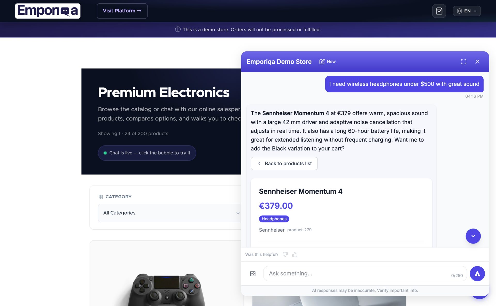

# Emporiqa Chat Assistant pour PrestaShop

Un client tape « veste chaude moins de 100 euros, imperméable » dans votre boutique. Votre recherche renvoie tout ce qui contient « veste » dans le titre. Le client scrolle, abandonne et part.

Le chatbot IA [Emporiqa](https://emporiqa.com) pour PrestaShop 8 et 9 est un vendeur en ligne qui conclut des ventes dans votre boutique PrestaShop. Le module synchronise votre catalogue produits et vos pages CMS vers Emporiqa, intègre le widget de chat sur votre boutique, et expose des endpoints pour les opérations de panier et le suivi de commandes dans le chat.

Le chatbot se comporte comme un vendeur en ligne. Les clients décrivent ce qu'ils cherchent (ou téléversent une photo de quelque chose qu'ils aiment), il trouve les produits correspondants dans votre catalogue, gère les objections comme « trop cher » avec des alternatives plutôt qu'une remise, répond aux questions depuis vos pages CMS, compare les articles, et les accompagne jusqu'au panier et à la commande en 65+ langues.

[](https://demo.emporiqa.com)

[](https://www.youtube.com/watch?v=txg-O_aTx0s)

> **[Présentation de l'intégration](https://emporiqa.com/fr/integrations/prestashop/)** · **[Documentation complète](https://emporiqa.com/fr/docs/prestashop/)** · **[Démo en ligne](https://demo.emporiqa.com)** · **[Tarifs](https://emporiqa.com/fr/pricing/)**

## Fonctionnalités

- **Conclut des ventes** : Gère les objections comme « trop cher » en proposant des alternatives depuis votre catalogue, plutôt qu'une remise.
- **Recherche visuelle** : Les clients téléversent une photo dans le widget ; le chatbot la décrit et trouve les produits correspondants dans votre catalogue PrestaShop synchronisé (aucune configuration supplémentaire requise).
- **Réponses sûres pour la marque** : Chaque réponse provient de vos produits et pages CMS synchronisés, jamais de données d'entraînement. Les questions à faible confiance sont transférées à votre équipe.
- **Sync produits** : Synchronisation en temps réel par webhooks des produits et déclinaisons (variations). Relations parent/enfant, attributs, prix (y compris les remises sur quantité / tarifs dégressifs), niveaux de stock et images inclus, ainsi que les indicateurs natifs PrestaShop `condition` (neuf/occasion/reconditionné), `is_virtual` (produits dématérialisés) et `available_for_order` (produits en mode catalogue / affichage seul).
- **Sync pages** : Pages CMS synchronisées avec le contenu par langue pour que l'assistant puisse répondre aux questions de support à partir de votre propre contenu.
- **Widget de chat** : Intégré automatiquement sur votre boutique dans la langue du visiteur.
- **Panier dans le chat** : Les clients peuvent ajouter, modifier, supprimer des articles et passer à la commande directement depuis le chat.
- **Suivi de commande** : Recherche de commande signée HMAC avec vérification email du client pour protéger les données. La réponse inclut le statut de la commande et les articles, ainsi que les informations d'expédition : nom du transporteur, numéro de suivi et URL de suivi (composée à partir du modèle d'URL du transporteur) une fois la commande expédiée.
- **Suivi de conversion** : Capture l'ID de session chat au moment du paiement et rapporte les événements de finalisation de commande pour l'attribution du revenu.
- **Multi-langue** : Mappage automatique des langues. Toutes les traductions sont consolidées en un seul payload webhook par entité.
- **Multi-boutique / multi-canal** : Découverte automatique des boutiques, chacune mappée à un canal Emporiqa via un slug du nom de boutique (ex. "Ma Boutique" → `ma-boutique`). Les produits et pages assignés à plusieurs boutiques incluent les liens, prix, stock et langues par canal dans un seul payload. Le canal est toujours transmis au widget et aux webhooks.
- **Connexion en un clic** : Une poignée de main signée lie votre boutique à votre compte Emporiqa en un clic. Aucun Store ID ni Connection Secret à copier entre les onglets. Le collage manuel reste disponible sur les sites HTTP.
- **Livraison différée bornée** : Les événements produit, page et commande s'accumulent pendant la requête et sont envoyés en une fois à la fin de la requête, avec un plafond strict de 1,5 seconde sur l'envoi synchrone. L'enregistrement admin et les imports CSV s'exécutent localement ; le webhook part après que la réponse a été envoyée, et la requête marchand ne peut jamais attendre plus de 1,5 seconde sur un Emporiqa lent.
- **Hooks d'extensibilité** : 7 hooks d'action pour les développeurs afin de personnaliser les payloads, annuler des syncs ou modifier le comportement du widget.

## Prérequis

- PrestaShop 8.1+ ou 9.x
- PHP 7.4+
- Un [compte Emporiqa](https://emporiqa.com/platform/create-store/). Inscription sans carte bancaire, 25 $ de crédit à l'inscription (~100 conversations) appliqué automatiquement

## Installation

1. Téléchargez le module depuis le [PrestaShop Addons Marketplace](https://addons.prestashop.com/).
2. Dans votre back office PrestaShop, allez dans **Modules > Gestionnaire de modules > Téléverser un module** et envoyez `emporiqa.zip`.
3. Cliquez sur **Configurer** sur le module Emporiqa.
4. Cliquez sur **Se connecter à Emporiqa**. Un nouvel onglet s'ouvre sur emporiqa.com. Créez un compte gratuit (sans carte, 25 $ de crédit à l'inscription) ou connectez-vous si vous en avez déjà un, puis choisissez la boutique à connecter (ou créez-en une nouvelle). Le module est connecté à votre retour.
5. Sur l'onglet **Sync**, cliquez sur **Envoyer mon catalogue**. Produits, pages et combinaisons remontent ; le widget apparaît sur votre vitrine dès que le premier produit arrive.

**Sur HTTP, ou vous préférez coller les identifiants vous-même ?** Dépliez **Modifier les identifiants manuellement** sur la page Configurer. Collez un **Store ID** et un **Connection Secret** depuis votre tableau de bord Emporiqa sous **Paramètres → Intégration Boutique**. Les deux chemins mènent au même résultat.

Pour le suivi de commande, copiez l'**URL de suivi de commande** affichée sur la page Configurer et collez-la dans votre tableau de bord Emporiqa sous **Intégration Boutique → Suivi de Commande** (l'URL est aussi déduite automatiquement par la connexion en un clic sur la plupart des configurations).

## Configuration

Tous les paramètres sont gérés depuis la page de configuration du module (**Modules > Emporiqa > Configurer**) :

**Paramètres de connexion**

Le chemin recommandé est **Se connecter à Emporiqa** (poignée de main en un clic, aucun identifiant à coller). Sur les sites HTTP ou pour une configuration manuelle, dépliez **Modifier les identifiants manuellement** :

| Paramètre | Description | Par défaut |
|-----------|-------------|------------|
| Store ID | Votre identifiant de boutique Emporiqa (rempli automatiquement par la connexion en un clic) | (aucun) |
| Connection Secret | Secret de signature HMAC-SHA256 (rempli automatiquement par la connexion en un clic) | (aucun) |
| URL de suivi de commande | Endpoint en lecture seule à coller dans votre tableau de bord Emporiqa | auto-généré |

**Avancé**

| Paramètre | Description | Par défaut |
|-----------|-------------|------------|
| Sync Produits | Activer la sync produits en temps réel | Activé |
| Sync Pages | Activer la sync des pages CMS en temps réel | Activé |
| Langues activées | Langues incluses dans les payloads de sync | Toutes les langues actives de la boutique |
| URL Webhook | Endpoint webhook Emporiqa | `https://emporiqa.com/webhooks/sync/` |
| Taille de lot | Produits/pages par requête webhook lors de la sync en masse | 25 |

Le suivi de commande (avec vérification email du client) et les opérations de panier dans le chat sont toujours activés. Aucune configuration nécessaire.

## Garder votre catalogue à jour

Le module pousse automatiquement à Emporiqa les changements de produits, pages et commandes au fur et à mesure via les hooks PrestaShop. Les changements par produit comme les promos programmées (SpecificPrice), les modifications d'images et les modifications de déclinaisons ré-émettent le produit concerné d'eux-mêmes ; les simples changements de stock ou de rupture envoient une mise à jour compacte de disponibilité uniquement, sans reconstruire le produit entier.

Certains changements affectent l'ensemble du catalogue (renommages de catégories ou de marques, rafraîchissement des taux de change, modifications de taux de TVA ou de groupes de règles de TVA, modifications de règles panier, nouvelles langues activées). Lancer une re-synchronisation produit par produit de façon synchrone depuis ces hooks bloquerait la requête admin ; le module enregistre donc plutôt un avertissement exploitable dans **Paramètres avancés → Journaux** et laisse le rafraîchissement du catalogue à une exécution manuelle.

Relancez une synchronisation complète depuis l'onglet **Sync** quand :

- Vous voyez l'un des avertissements de « changement à l'échelle du catalogue » dans le journal PrestaShop
- Vous ajoutez une nouvelle boutique en mode multi-boutique (les produits existants ne porteront pas les données de la nouvelle boutique tant qu'aucune autre opération ne les touche)
- Vous importez des produits en masse depuis un fichier CSV (PrestaShop contourne parfois les hooks standards lors des imports en masse)
- Un script personnalisé, une migration ou un autre module écrit directement en base
- Emporiqa a été injoignable pendant une période prolongée (panne réseau, maintenance, identifiants expirés)

Par sécurité, lancez une synchronisation complète une fois par semaine pour rattraper toute dérive éventuelle.

## Structure du module

```
emporiqa/
├── emporiqa.php                 # Classe principale du module (hooks, install, config)
├── config.xml                   # Métadonnées du module
├── logo.png                     # Icône du module
├── classes/
│   ├── EmporiqaCartHandler.php       # Opérations de panier dans le chat
│   ├── EmporiqaChannelResolver.php   # Mappage multi-boutique → canal
│   ├── EmporiqaLanguageHelper.php    # Utilitaires de mappage des langues
│   ├── EmporiqaOrderFormatter.php    # Formatage du payload commande
│   ├── EmporiqaPageFormatter.php     # Formatage du payload page CMS
│   ├── EmporiqaProductFormatter.php  # Formatage du payload produit/déclinaison
│   ├── EmporiqaSignatureHelper.php   # Signature et vérification HMAC-SHA256
│   ├── EmporiqaSyncService.php       # Orchestration de la sync en masse
│   └── EmporiqaWebhookClient.php     # Client HTTP pour la livraison des webhooks
├── controllers/
│   ├── admin/
│   │   ├── AdminEmporiqaController.php        # Redirection onglet menu admin
│   │   └── AdminEmporiqaConnectController.php # Handshake de connexion en un clic
│   └── front/
│       ├── cartapi.php               # Endpoint API panier (/module/emporiqa/cartapi)
│       └── ordertracking.php         # Endpoint suivi de commande (/module/emporiqa/ordertracking)
├── views/
│   ├── css/admin.css                 # Styles de configuration admin
│   ├── img/                          # Images du module (logo rectangulaire)
│   ├── js/
│   │   ├── admin-sync.js            # UI de sync en masse avec suivi de progression
│   │   └── front-cart-handler.js    # Intégration panier du widget chat
│   └── templates/
│       ├── admin/configure.tpl       # Template de la page de configuration
│       ├── admin/sync_tab.tpl        # Template de l'onglet synchronisation
│       └── hook/header.tpl           # Embed du widget (hook displayHeader)
├── translations/                     # Catalogues de traduction
└── upgrade/                          # Scripts de mise à jour de version
```

## Fonctionnement

### Sync par Webhooks

Quand un produit ou une page CMS est créé, modifié ou supprimé dans PrestaShop, le module enregistre le changement dans une table par-requête et inscrit un unique `register_shutdown_function`. À la fermeture de la requête, le module lit l'état final en base et envoie un webhook par entité modifiée, avec un plafond strict de 1,5 seconde sur l'appel HTTP (500 ms de handshake, 1500 ms total). Cette synchronisation tardive permet que la réponse admin ou checkout du marchand soit envoyée en premier (via `fastcgi_finish_request` sous PHP-FPM quand disponible) ; le webhook part ensuite, plafonné, et la requête marchand ne peut jamais attendre plus de 1,5 seconde même si Emporiqa est injoignable.


Tous les webhooks sont signés avec HMAC-SHA256 via le header `X-Webhook-Signature` pour la vérification de l'intégrité du payload.

### Déclinaisons de produits

Les produits PrestaShop avec déclinaisons sont synchronisés avec leur structure complète de variations. Le produit parent porte le nom, la description et les images partagés, tandis que chaque déclinaison porte ses attributs spécifiques (taille, couleur, etc.), son prix et son stock. L'assistant comprend "cette veste existe en bleu et rouge, tailles S à XL."

Le payload complet du produit (et des déclinaisons) inclut aussi quelques indicateurs natifs PrestaShop et champs de prix pour que l'assistant décrive et vende les produits avec précision :

- `condition` : chaîne ou null ; la `condition` du produit PrestaShop (`"new"`, `"used"` ou `"refurbished"`).
- `is_virtual` : booléen ; vrai pour les produits dématérialisés sans expédition.
- `available_for_order` : booléen ; faux pour les produits en mode catalogue / affichage seul. L'assistant les décrit toujours mais ne les ajoute pas au panier.
- `max_order_quantities` : dictionnaire par canal (`{canal: int|null}`) de la quantité maximale autorisée par commande. PrestaShop n'a pas de maximum natif par commande, donc ce champ envoie toujours `null` (aucune limite) pour l'instant. Il est inclus pour la parité de contrat entre plateformes, afin qu'une source personnalisée future puisse le renseigner.
- `tier_prices` : liste par devise des remises sur quantité / tarifs dégressifs (`[{min_quantity, price}]`), présente sur une entrée de prix uniquement lorsque le produit ou la déclinaison a des remises sur quantité configurées dans PrestaShop. Chaque palier reflète le prix unitaire vu par le client public (visiteur) à ce seuil, afin que l'assistant puisse annoncer « X l'unité à partir de 10 ». Les paliers réservés à un groupe, un client ou un pays (B2B) sont volontairement exclus.

Ces indicateurs font partie du payload complet produit et déclinaison, pas de l'événement léger `product.availability`. Les simples changements de stock/disponibilité évitent la reconstruction complète et envoient un événement compact `product.availability` ne portant que le numéro d'identification, le SKU, les statuts de disponibilité par canal et les quantités en stock, une entrée par produit simple ou par déclinaison.

### Multi-langue

Chaque langue active de la boutique est mappée à un code langue standard. Un produit avec des traductions en 3 langues est envoyé en un seul payload webhook avec toutes les traductions imbriquées : moins de requêtes HTTP, données cohérentes.

### Hooks PrestaShop enregistrés

| Hook | Fonction |
|------|----------|
| `displayHeader` | Intègre le widget de chat sur la boutique |
| `actionProductSave` | Synchronise le produit à la création/modification |
| `actionProductDelete` | Envoie l'événement de suppression pour le produit et ses variations |
| `actionObjectCombination{Add,Update,Delete}After` | Synchronise le produit parent quand les déclinaisons changent |
| `actionObjectCms{Add,Update,Delete}After` | Synchronise les pages CMS à la création/modification/suppression |
| `actionValidateOrder` | Capture l'ID de session chat et envoie l'événement order.completed |
| `actionOrderStatusPostUpdate` | Envoie order.completed pour les captures de paiement tardives |
| `actionUpdateQuantity` | Émet un événement léger `product.availability` quand le stock change (sans reconstruction complète du produit) |
| `actionProductOutOfStock` | Émet un événement `product.availability` lors des transitions de seuil de stock |
| `actionObjectSpecificPrice{Add,Update,Delete}After` | Re-synchronise le produit concerné lors des promos programmées, réductions par groupe et remises sur quantité (tarifs dégressifs) |
| `actionObjectImage{Add,Update,Delete}After` | Re-synchronise le produit concerné quand ses images changent |
| `actionObjectCategory{Update,Delete}After` | Enregistre un avertissement exploitable pour que le marchand lance une sync complète (impact à l'échelle du catalogue) |
| `actionObjectManufacturer{Update,Delete}After` | Enregistre un avertissement exploitable pour que le marchand lance une sync complète (impact à l'échelle du catalogue) |
| `actionObjectCartRule{Add,Update,Delete}After` | Enregistre un avertissement exploitable pour que le marchand lance une sync complète (impact à l'échelle du catalogue) |
| `actionObjectCurrencyUpdateAfter` | Enregistre un avertissement exploitable pour que le marchand lance une sync complète (impact prix à l'échelle du catalogue) |
| `actionObjectTaxUpdateAfter` / `actionObjectTaxRulesGroupUpdateAfter` | Enregistre un avertissement exploitable pour que le marchand lance une sync complète (impact prix à l'échelle du catalogue) |
| `actionObjectLanguageAddAfter` | Enregistre un avertissement exploitable pour que le marchand lance une sync complète (nouvelle locale à compléter) |

## Hooks d'extensibilité

Les développeurs peuvent se brancher sur le pipeline de sync pour personnaliser les payloads ou annuler des syncs :

| Hook | Fonction | Paramètres clés |
|------|----------|-----------------|
| `actionEmporiqaFormatProduct` | Modifier le payload produit/variation avant envoi | `&$data`, `$product`, `$event_type` |
| `actionEmporiqaFormatPage` | Modifier le payload page avant envoi | `&$data`, `$page`, `$event_type` |
| `actionEmporiqaFormatOrder` | Modifier le payload de suivi de commande | `&$data`, `$order` |
| `actionEmporiqaShouldSyncProduct` | Annuler conditionnellement une sync produit | `$product`, `$event_type`, `&$should_sync` |
| `actionEmporiqaShouldSyncPage` | Annuler conditionnellement une sync page | `$page`, `$event_type`, `&$should_sync` |
| `actionEmporiqaWidgetParams` | Modifier les paramètres d'embed du widget chat | `&$params` |
| `actionEmporiqaOrderTracking` | Modifier la réponse de suivi de commande | `&$data`, `$order` |

## Tarifs

Le module est gratuit. Emporiqa fonctionne en paiement à l'usage : 0 $/mois de base + 0,25 $/conversation. Les nouveaux comptes reçoivent 25 $ de crédit à l'inscription (environ 100 conversations offertes), sans carte requise au moment de la création du compte. Une fois le crédit épuisé, le plafond mensuel par défaut est de 59 $, ajustable depuis le tableau de bord de facturation. Option Enterprise pour les catalogues de plus de 30 000 produits. Tarifs complets sur [emporiqa.com/fr/pricing/](https://emporiqa.com/fr/pricing/).

Emporiqa fonctionne aussi avec Drupal Commerce, WooCommerce, Magento, Shopware, Sylius, et avec toute boutique via API webhook. Un seul compte Emporiqa et un tableau de bord pour toutes.

## Documentation & Support

- **Présentation de l'intégration** : [https://emporiqa.com/fr/integrations/prestashop/](https://emporiqa.com/fr/integrations/prestashop/)
- **Documentation complète** : [https://emporiqa.com/fr/docs/prestashop/](https://emporiqa.com/fr/docs/prestashop/) (détails de configuration, référence du format webhook, exemples de hooks, dépannage)
- **Email** : support@emporiqa.com

## Licence

[Academic Free License 3.0 (AFL-3.0)](https://opensource.org/licenses/AFL-3.0)
