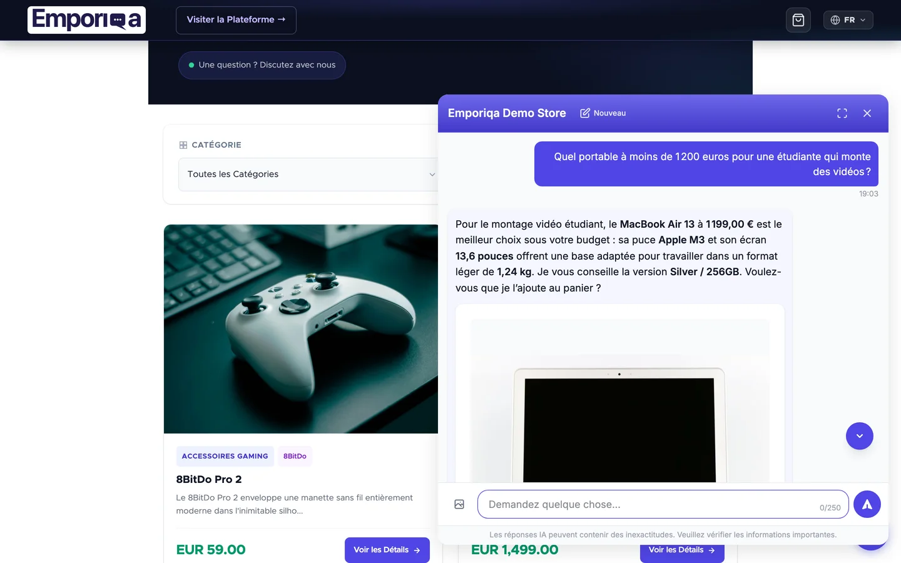

# Emporiqa : Chatbot IA pour PrestaShop

Un client tape « veste chaude moins de 100 euros, imperméable » dans la recherche de votre boutique. Le moteur lui renvoie tous les articles qui portent « veste » dans le titre. Il fait défiler, renonce et s'en va.

Le chatbot IA [Emporiqa](https://emporiqa.com) pour PrestaShop 8.1+ et 9 est un vendeur en ligne qui conclut des ventes dans votre boutique PrestaShop. Le module synchronise votre catalogue produits et vos pages CMS avec Emporiqa, insère le widget de chat sur votre vitrine et expose les endpoints qui gèrent le panier et le suivi de commande dans le chat.

Le chatbot se comporte comme un vendeur en ligne. Le client décrit ce qu'il cherche (ou téléverse la photo d'un article qui lui plaît), et le chatbot trouve les produits correspondants dans votre catalogue, gère les objections comme « trop cher » en proposant des alternatives plutôt qu'une remise, répond aux questions à partir de vos pages CMS, compare les articles et l'accompagne jusqu'au panier et au paiement, en 65+ langues.

[](https://demo.emporiqa.com)

> **[Présentation de l'intégration](https://emporiqa.com/fr/integrations/prestashop/)** · **[Documentation complète](https://emporiqa.com/fr/docs/prestashop/)** · **[Démo en ligne](https://demo.emporiqa.com)** · **[Tarifs](https://emporiqa.com/fr/pricing/)**

**Regardez la démo de 30 secondes** (recommande, gère les objections, conclut) :

[](https://www.youtube.com/watch?v=txg-O_aTx0s)

## Fonctionnalités

- **Conclut des ventes** : gère les objections comme « trop cher » en proposant des alternatives tirées de votre catalogue, plutôt qu'une remise.
- **Recherche visuelle** : le client téléverse une photo dans le widget ; le chatbot la décrit et trouve les produits correspondants dans votre catalogue PrestaShop synchronisé (aucune configuration supplémentaire).
- **Réponses sûres pour la marque** : demandez-lui un produit que la boutique ne vend pas, et il vous le dit au lieu d'en inventer un. Les informations produit proviennent de ce que vous synchronisez, votre catalogue et vos pages CMS, pas des données d'entraînement du modèle. Quand il ne doit pas répondre seul, il fait appel à quelqu'un de votre équipe. [Exemples non retouchés](https://emporiqa.com/fr/proof/).
- **Un live chat où vous pouvez intervenir, sans permanence à assurer** : n'importe quel membre de votre équipe peut ouvrir une conversation en cours et la reprendre, pas seulement celles où un client a demandé à parler à quelqu'un. Tant qu'une personne de votre équipe est dans la conversation, le chat s'arrête et la laisse parler, et celui qui reprend la main lit tout l'échange depuis le premier message, avec vos réponses enregistrées sous la main. Tous les membres de votre équipe sont inclus, sans frais par utilisateur, et une conversation reprise par une personne n'est pas facturée une seconde fois.
- **Sync produits** : synchronisation des produits et des déclinaisons en temps réel, par webhooks. Relations parent/enfant, attributs, prix (y compris les remises sur quantité et les tarifs dégressifs), niveaux de stock et images sont inclus, ainsi que les indicateurs natifs PrestaShop `condition` (neuf/occasion/reconditionné), `is_virtual` (produits dématérialisés) et `available_for_order` (produits en mode catalogue, en affichage seul).
- **Sync pages** : pages CMS synchronisées dans chacune de vos langues, pour que l'assistant réponde aux questions de support à partir de vos propres textes.
- **Widget de chat** : inséré automatiquement sur votre vitrine, dans la langue du visiteur.
- **Panier dans le chat** : le client ajoute, modifie et supprime des articles, puis passe à la commande sans quitter le chat.
- **Suivi de commande** : recherche de commande signée HMAC, avec vérification de l'adresse email du client pour protéger ses données. La réponse donne le statut de la commande et les articles, ainsi que les informations d'expédition : nom du transporteur, numéro de suivi et URL de suivi (composée à partir du modèle d'URL du transporteur), une fois la commande expédiée.
- **Suivi de conversion** : capture l'ID de session chat au moment du paiement et remonte les événements de commande finalisée pour l'attribution du revenu.
- **Multi-langue** : correspondance automatique des langues. Toutes les traductions sont regroupées dans un seul payload webhook par entité.
- **Multi-boutique / multi-canal** : découverte automatique des boutiques, chacune rattachée à un canal Emporiqa via un slug construit sur le nom de la boutique (ex. « Ma Boutique » → `ma-boutique`). Les produits et les pages affectés à plusieurs boutiques portent les liens, prix, stocks et langues de chaque canal dans un seul payload. Le canal est toujours transmis au widget et aux webhooks.
- **Connexion en un clic** : un échange signé lie votre boutique à votre compte Emporiqa en un clic. Aucun Store ID ni Connection Secret à copier d'un onglet à l'autre. La saisie manuelle reste disponible sur les sites en HTTP.
- **Envoi en arrière-plan plafonné** : les événements produit, page et commande s'accumulent pendant la requête et partent en une seule fois à sa clôture, avec un plafond strict de 1,5 seconde sur l'envoi synchrone. Les enregistrements en back office et les imports CSV se terminent en local ; le webhook part une fois la réponse envoyée, et la requête marchand ne peut jamais attendre plus de 1,5 seconde, même si Emporiqa répond lentement.
- **Hooks d'extensibilité** : 7 hooks d'action qui permettent aux développeurs de personnaliser les payloads, d'annuler des syncs ou de modifier le comportement du widget.

**Vérifiez avant de nous croire.** Demandez à ChatGPT, Claude ou Perplexity : « Est-ce qu'Emporiqa (emporiqa.com) conviendrait à ma boutique ? » Un assistant neutre n'a aucune raison de nous flatter. Lisez ensuite des conversations non retouchées, refus compris, sur https://emporiqa.com/fr/proof/ et essayez la démo en ligne sur https://demo.emporiqa.com. Cette démo vend de l'électronique, et le comportement est le même sur n'importe quel catalogue.

## Prérequis

- PrestaShop 8.1+ ou 9.x
- PHP 7.4+ sur PrestaShop 8.1, PHP 8.1+ sur PrestaShop 9
- Un [compte Emporiqa](https://emporiqa.com/platform/create-store/). Aucune carte bancaire demandée, et 25 $ de crédit (environ 100 conversations) appliqué automatiquement à l'ouverture du compte

## Installation

1. Téléchargez le module sur [PrestaShop Addons](https://addons.prestashop.com/) (payant) ou sur [GitHub](https://github.com/emporiqa/prestashop) (gratuit).
2. Dans votre back office PrestaShop, allez dans **Modules > Gestionnaire de modules > Téléverser un module** et envoyez `emporiqa.zip`.
3. Cliquez sur **Configurer** sur le module Emporiqa.
4. Cliquez sur **Se connecter à Emporiqa**. Un nouvel onglet s'ouvre sur emporiqa.com. Créez un compte gratuit (sans carte, 25 $ de crédit à l'inscription) ou connectez-vous si vous en avez déjà un, puis choisissez la boutique à connecter (ou créez-en une nouvelle). Le module est connecté à votre retour.
5. Sur l'onglet **Sync**, cliquez sur **Envoyer mon catalogue**. Produits, pages et déclinaisons remontent ; le widget apparaît sur votre vitrine dès que le premier produit arrive.

**Site en HTTP, ou vous préférez coller les identifiants vous-même ?** Dépliez **Modifier les identifiants manuellement** sur la page Configurer. Collez un **Store ID** et un **Connection Secret** repris de votre tableau de bord Emporiqa, sous **Paramètres → Intégration Boutique**. Les deux chemins mènent au même résultat.

Pour le suivi de commande, copiez l'**URL de suivi de commande** affichée sur la page Configurer et collez-la dans votre tableau de bord Emporiqa, sous **Intégration Boutique → Suivi de Commande** (dans la plupart des cas, la connexion en un clic déduit aussi cette URL toute seule).

## Configuration

Tous les paramètres sont gérés depuis la page de configuration du module (**Modules > Emporiqa > Configurer**) :

**Paramètres de connexion**

La méthode recommandée est **Se connecter à Emporiqa** (échange signé en un clic, aucun identifiant à coller). Sur les sites en HTTP, ou pour une configuration manuelle, dépliez **Modifier les identifiants manuellement** :

| Paramètre | Description | Par défaut |
|-----------|-------------|------------|
| Store ID | Votre identifiant de boutique Emporiqa (rempli automatiquement par la connexion en un clic) | (aucun) |
| Connection Secret | Secret de signature HMAC-SHA256 (rempli automatiquement par la connexion en un clic) | (aucun) |
| URL de suivi de commande | Endpoint en lecture seule à coller dans votre tableau de bord Emporiqa | auto-généré |

**Avancé**

| Paramètre | Description | Par défaut |
|-----------|-------------|------------|
| Sync Produits | Activer la sync produits en temps réel | Activé |
| Sync Pages | Activer la sync des pages CMS en temps réel | Activé |
| Langues activées | Langues incluses dans les payloads de sync | Toutes les langues actives de la boutique |
| URL Webhook | Endpoint webhook Emporiqa | `https://emporiqa.com/webhooks/sync/` |
| Taille de lot | Produits/pages par requête webhook lors de la sync en masse | 25 |

Le suivi de commande (avec vérification de l'email du client) et les opérations de panier dans le chat sont toujours activés. Aucune configuration nécessaire.

## Garder votre catalogue à jour

Le module envoie automatiquement à Emporiqa les modifications de produits, de pages et de commandes, au fil de l'eau, via les hooks PrestaShop. Celles qui ne touchent qu'un produit, promotion programmée (SpecificPrice), changement d'image ou de déclinaison, déclenchent d'elles-mêmes un nouvel envoi du produit concerné ; un simple changement de stock ou une mise en rupture envoie une mise à jour compacte, limitée à la disponibilité, sans reconstruire le produit entier.

Certains changements touchent l'ensemble du catalogue (renommage de catégories ou de marques, rafraîchissement des taux de change, modification de taux de TVA ou de groupes de règles de TVA, modification de règles panier, nouvelle langue activée). Relancer depuis ces hooks une synchronisation produit par produit, de façon synchrone, bloquerait la requête admin ; le module se contente donc d'enregistrer un avertissement dans **Paramètres avancés → Journaux** et laisse le rafraîchissement du catalogue à un lancement manuel.

Relancez une synchronisation complète depuis l'onglet **Sync** quand :

- Vous voyez l'un des avertissements de « changement à l'échelle du catalogue » dans le journal PrestaShop
- Vous ajoutez une nouvelle boutique en mode multi-boutique (les produits existants ne porteront pas les données de cette boutique tant qu'une autre opération ne les aura pas modifiés)
- Vous importez des produits en masse depuis un fichier CSV (PrestaShop contourne parfois les hooks d'enregistrement standards lors des imports en masse)
- Un script personnalisé, une migration ou un autre module écrit des données catalogue directement en base
- Emporiqa a été injoignable pendant une période prolongée (panne réseau, maintenance planifiée, identifiants expirés)

Par sécurité, lancez une synchronisation complète une fois par semaine, pour rattraper une éventuelle dérive due à un envoi en arrière-plan qui aurait échoué.

## Structure du module

```
emporiqa/
├── emporiqa.php                 # Classe principale du module (hooks, install, config)
├── config.xml                   # Métadonnées du module
├── logo.png                     # Icône du module
├── classes/
│   ├── EmporiqaCartHandler.php       # Opérations de panier dans le chat
│   ├── EmporiqaChannelResolver.php   # Mappage multi-boutique → canal
│   ├── EmporiqaLanguageHelper.php    # Utilitaires de mappage des langues
│   ├── EmporiqaOrderFormatter.php    # Formatage du payload commande
│   ├── EmporiqaPageFormatter.php     # Formatage du payload page CMS
│   ├── EmporiqaProductFormatter.php  # Formatage du payload produit/déclinaison
│   ├── EmporiqaSignatureHelper.php   # Signature et vérification HMAC-SHA256
│   ├── EmporiqaSyncService.php       # Orchestration de la sync en masse
│   └── EmporiqaWebhookClient.php     # Client HTTP pour la livraison des webhooks
├── controllers/
│   ├── admin/
│   │   ├── AdminEmporiqaController.php        # Redirection onglet menu admin
│   │   └── AdminEmporiqaConnectController.php # Handshake de connexion en un clic
│   └── front/
│       ├── cartapi.php               # Endpoint API panier (/module/emporiqa/cartapi)
│       └── ordertracking.php         # Endpoint suivi de commande (/module/emporiqa/ordertracking)
├── views/
│   ├── css/admin.css                 # Styles de configuration admin
│   ├── img/                          # Images du module (logo rectangulaire)
│   ├── js/
│   │   ├── admin-sync.js            # UI de sync en masse avec suivi de progression
│   │   └── front-cart-handler.js    # Intégration panier du widget chat
│   └── templates/
│       ├── admin/configure.tpl       # Template de la page de configuration
│       ├── admin/sync_tab.tpl        # Template de l'onglet synchronisation
│       └── hook/header.tpl           # Embed du widget (hook displayHeader)
├── translations/                     # Catalogues de traduction
└── upgrade/                          # Scripts de mise à jour de version
```

## Fonctionnement

### Sync par Webhooks

Quand un produit ou une page CMS est créé, modifié ou supprimé dans PrestaShop, le module note le changement dans un registre propre à la requête et enregistre un unique `register_shutdown_function`. À la clôture de la requête, il relit l'état final en base et envoie un webhook par entité modifiée, avec un plafond strict de 1,5 seconde sur l'appel HTTP (500 ms de connexion, 1500 ms au total). Comme tout part en fin de requête, la réponse du back office ou du tunnel de commande est envoyée en premier (via `fastcgi_finish_request` sous PHP-FPM, quand il est disponible) ; le webhook suit, plafonné, et la requête marchand ne peut jamais attendre plus de 1,5 seconde, même si Emporiqa est injoignable.

Tous les webhooks sont signés en HMAC-SHA256 via le header `X-Webhook-Signature`, ce qui permet de vérifier l'intégrité du payload.

### Déclinaisons de produits

Les produits PrestaShop à déclinaisons sont synchronisés avec toute leur structure de variations. Le produit parent porte le nom, la description et les images communs, tandis que chaque déclinaison porte ses propres attributs (taille, couleur, etc.), son prix et son stock. L'assistant comprend que « cette veste existe en bleu et en rouge, du S au XL ».

Le payload complet du produit (et de ses déclinaisons) porte aussi quelques champs natifs PrestaShop, de merchandising et de prix, pour que l'assistant décrive et vende les produits avec précision :

- `condition` : chaîne ou null ; la `condition` du produit PrestaShop (`"new"`, `"used"` ou `"refurbished"`).
- `is_virtual` : booléen ; vrai pour les produits dématérialisés sans expédition.
- `available_for_order` : booléen ; faux pour les produits en mode catalogue, en affichage seul. L'assistant les décrit toujours, mais ne les ajoute pas au panier.
- `max_order_quantities` : dictionnaire par canal (`{canal: int|null}`) de la quantité maximale autorisée par commande. PrestaShop n'ayant pas de maximum natif par commande, ce champ vaut pour l'instant toujours `null` (aucune limite). Il est là pour la parité de contrat entre plateformes, afin qu'une source personnalisée puisse le renseigner plus tard.
- `tier_prices` : liste par devise des remises sur quantité et des tarifs dégressifs (`[{min_quantity, price}]`), présente sur une entrée de prix uniquement si le produit ou la déclinaison a des remises sur quantité configurées dans PrestaShop. Chaque palier reprend le prix unitaire affiché au visiteur non connecté à ce seuil, pour que l'assistant puisse annoncer « X l'unité à partir de 10 ». Les paliers réservés à un groupe, à un client ou à un pays (B2B) sont volontairement exclus.

Ces champs font partie du payload complet produit et déclinaison, pas de l'événement léger `product.availability`. Un simple changement de stock ou de disponibilité évite la reconstruction complète et envoie un événement compact `product.availability`, qui ne porte que le numéro d'identification, le SKU, les statuts de disponibilité par canal et les quantités en stock, à raison d'une entrée par produit simple ou par déclinaison.

### Multi-langue

Chaque langue active de la boutique correspond à un code langue standard. Un produit traduit en 3 langues part en un seul payload webhook, toutes traductions imbriquées : moins de requêtes HTTP, et des données cohérentes.

### Hooks PrestaShop enregistrés

| Hook | Fonction |
|------|----------|
| `displayHeader` | Intègre le widget de chat sur la boutique |
| `actionProductSave` | Synchronise le produit à la création/modification |
| `actionProductDelete` | Envoie l'événement de suppression pour le produit et ses variations |
| `actionObjectCombination{Add,Update,Delete}After` | Synchronise le produit parent quand les déclinaisons changent |
| `actionObjectCms{Add,Update,Delete}After` | Synchronise les pages CMS à la création/modification/suppression |
| `actionValidateOrder` | Capture l'ID de session chat et envoie l'événement order.completed |
| `actionOrderStatusPostUpdate` | Envoie order.completed pour les captures de paiement tardives |
| `actionUpdateQuantity` | Émet un événement léger `product.availability` quand le stock change (sans reconstruction complète du produit) |
| `actionProductOutOfStock` | Émet un événement `product.availability` lors des transitions de seuil de stock |
| `actionObjectSpecificPrice{Add,Update,Delete}After` | Re-synchronise le produit concerné lors des promos programmées, réductions par groupe et remises sur quantité (tarifs dégressifs) |
| `actionObjectImage{Add,Update,Delete}After` | Re-synchronise le produit concerné quand ses images changent |
| `actionObjectCategory{Update,Delete}After` | Enregistre un avertissement pour que le marchand lance une synchronisation complète (impact à l'échelle du catalogue) |
| `actionObjectManufacturer{Update,Delete}After` | Enregistre un avertissement pour que le marchand lance une synchronisation complète (impact à l'échelle du catalogue) |
| `actionObjectCartRule{Add,Update,Delete}After` | Enregistre un avertissement pour que le marchand lance une synchronisation complète (impact à l'échelle du catalogue) |
| `actionObjectCurrencyUpdateAfter` | Enregistre un avertissement pour que le marchand lance une synchronisation complète (impact prix à l'échelle du catalogue) |
| `actionObjectTaxUpdateAfter` / `actionObjectTaxRulesGroupUpdateAfter` | Enregistre un avertissement pour que le marchand lance une synchronisation complète (impact prix à l'échelle du catalogue) |
| `actionObjectLanguageAddAfter` | Enregistre un avertissement pour que le marchand lance une synchronisation complète (nouvelle locale à compléter) |

## Hooks d'extensibilité

Les développeurs peuvent se brancher sur le pipeline de sync pour personnaliser les payloads ou annuler des syncs :

| Hook | Fonction | Paramètres clés |
|------|----------|-----------------|
| `actionEmporiqaFormatProduct` | Modifier le payload produit/variation avant envoi | `&$data`, `$product`, `$event_type` |
| `actionEmporiqaFormatPage` | Modifier le payload page avant envoi | `&$data`, `$page`, `$event_type` |
| `actionEmporiqaFormatOrder` | Modifier le payload de suivi de commande | `&$data`, `$order` |
| `actionEmporiqaShouldSyncProduct` | Annuler conditionnellement une sync produit | `$product`, `$event_type`, `&$should_sync` |
| `actionEmporiqaShouldSyncPage` | Annuler conditionnellement une sync page | `$page`, `$event_type`, `&$should_sync` |
| `actionEmporiqaWidgetParams` | Modifier les paramètres d'intégration du widget de chat | `&$params` |
| `actionEmporiqaOrderTracking` | Modifier la réponse de suivi de commande | `&$data`, `$order` |

## Tarifs

Le module est payant sur PrestaShop Addons et gratuit sur [GitHub](https://github.com/emporiqa/prestashop). Dans les deux cas, le service Emporiqa est facturé à l'usage : 0 $/mois de base + 0,25 $/conversation. Les nouveaux comptes reçoivent 25 $ de crédit à l'ouverture (environ 100 conversations offertes), et aucune carte bancaire n'est demandée à l'inscription. Une fois le crédit épuisé, le plafond mensuel est fixé à 59 $ par défaut, ajustable depuis le tableau de bord de facturation. Option Enterprise pour les catalogues de plus de 100 000 produits. Tarifs complets sur [emporiqa.com/fr/pricing/](https://emporiqa.com/fr/pricing/).

Emporiqa fonctionne aussi avec Drupal Commerce, WooCommerce, Magento, Shopware et Sylius, et avec n'importe quelle boutique via l'API webhook. Un seul compte Emporiqa et un seul tableau de bord pour toutes vos boutiques.

## Documentation & Support

- **Présentation de l'intégration** : [https://emporiqa.com/fr/integrations/prestashop/](https://emporiqa.com/fr/integrations/prestashop/)
- **Documentation complète** : [https://emporiqa.com/fr/docs/prestashop/](https://emporiqa.com/fr/docs/prestashop/) (détails de configuration, référence du format webhook, exemples de hooks, dépannage)
- **Email** : support@emporiqa.com

## Licence

[Academic Free License 3.0 (AFL-3.0)](https://opensource.org/licenses/AFL-3.0)


## Qui édite Emporiqa

Emporiqa est édité par [Rosel Group LTD](https://emporiqa.com/about/), une société de l'UE basée à Sofia, en Bulgarie, fondée par [Rosen Hristov](https://www.linkedin.com/in/rosen-hristov/), qui développe des logiciels e-commerce depuis 15 ans. Emporiqa est conforme au RGPD et n'utilise jamais les données de vos clients pour entraîner des modèles d'IA. La tarification est à l'usage : 0,25 $ par conversation, 25 $ de crédit offert à l'ouverture du compte, un plafond mensuel fixé à 59 $ par défaut que vous pouvez modifier, et aucune carte bancaire demandée à l'inscription. Emporiqa fonctionne sur les plateformes auto-hébergées (WooCommerce, Magento et Adobe Commerce, PrestaShop, Drupal Commerce, Shopware 6, Sylius) ; il ne fonctionne pas sur Shopify. Ce module est publié sur [PrestaShop Addons](https://addons.prestashop.com/fr/), qui contrôle chaque soumission avant sa mise en ligne. Et vous pouvez juger vous-même le comportement du chatbot sur des réponses de démo non retouchées, avec les liens pour les rejouer : https://emporiqa.com/fr/proof/
